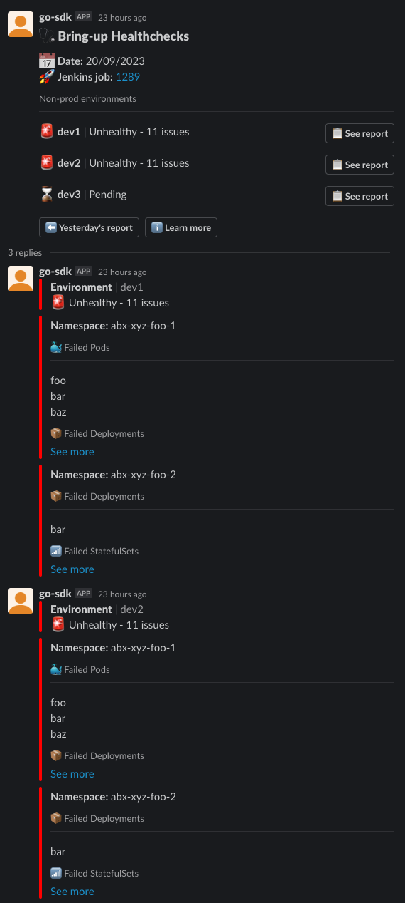

# slacker

A Go utility to send structured reports in a formatted output to Slack.

## Report format

See `examples/full.json` for an example.

## Slack format

This will send an initial message to the specified `--channel`, with a summary
of each environment.

Then, a reply will be generated for each environment with a `completed` status,
detailing each individual namespace and the failures within each section.



## Usage

```bash
./slacker my-report.json --channel="alerts" --report-base-url https://reports.com --token slack-api-token --verbose
# or via stdin
generate-report.sh | ./slacker --channel="alerts" --report-base-url https://reports.com --token slack-api-token --verbose
```

See `./slacker --help` for flags.

**NOTE:** Flags can be replaced with env vars, eg. `--report-base-url` can be provided as `REPORT_BASE_URL=...`

```
slacker slack-report --help
Parses a report JSON, either from file or from stdin.

Example JSON report:
{
  "environments": [
    {
      "name":  a new message if it doesn't exist
slacker slack-report --channel alerts --token redacted --report-base-url https://my-reports --look-up-last-report report.json"abx-xyz-foo-2",
      "sections": [
        {
          "name": "Failed Deployments",
          "icon": ":package:",
          "failures": ["foo", "bar", "baz"]
        }
      ]
    }
  ]
}

Usage:
  slacker slack-report [FILE] [flags]

Examples:
# Automatically look up today's report and attempt to update it, or create

# Send the report for a specific date, updating it if it already exists
slacker slack-report --channel alerts --token redacted --report-base-url https://my-reports --look-up-last-report --report-date "03-01-2023" report.json

# Send the report, specifying a specific message timestamp to overwrite
# (This will fail if the message doesn't exist)
slacker slack-report --channel alerts --token redacted --report-base-url https://my-reports --update-message-ts abcdef.abcdef report.json

# Collect the report JSON from stdin and create a brand new report
my-report.sh | slacker slack-report --token redacted --channel alerts --report-base-url https://my-reports -

# Using env vars for config instead of CLI flags
TOKEN=redacted CHANNEL=alerts REPORT_BASE_URL=https://my-reports slacker slack-report

Flags:
      --channel string             [REQUIRED] Slack channel name to send to
      --dry-run                    Use dry-run mode
  -h, --help                       help for slack-report
      --lookup-last-report         Look up the last report automatically
      --report-base-url string     [REQUIRED] Base URL used to build links to reports
      --report-date string         Report date in dd-mm-yyyy format (default "27-09-2023")
      --token string               [REQUIRED] Slack API token to use
      --update-environments        Whether to update existing environment messages (default true)
      --update-message-ts string   The TS of a message to update & reply to

Global Flags:
      --verbose   Show Debug log
```
